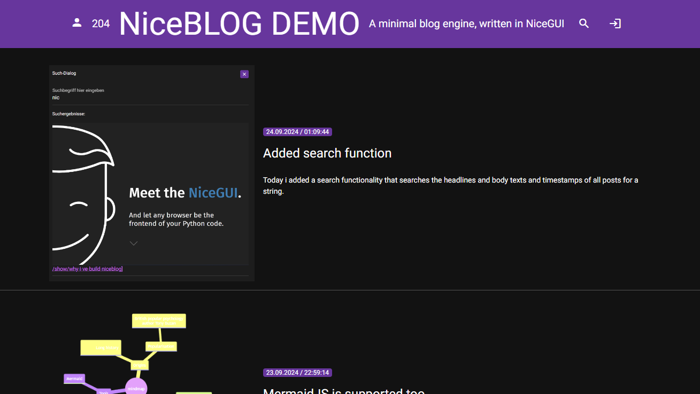

# Niceblog

## A simple Blog engine made with [NiceGUI](https://nicegui.io)


### Screenshot



### How to install

## Docker

Set `NICEBLOG_USER`, `NICEBLOG_PASSWORD`, `NICEBLOG_HEADER_NAME`, `NICEBLOG_STORAGE_SECRET`, `NICEBLOG_LANGUAGE`, `NICEBLOG_TIMEZONE` and `NICEBLOG_HEADER_TITLE` to your liking.

```
docker run \
    -d \
    --name niceblog \
    -e "NICEBLOG_USER=username" \
    -e "NICEBLOG_PASSWORD=password" \
    -e "NICEBLOG_HEADER_NAME=NiceBLOG" \
    -e "NICEBLOG_HEADER_TITLE=A minimal blog engine written in NiceGUI" \
    -e "NICEBLOG_LANGUAGE=en-US" \
    -e "NICEBLOG_TIMEZONE=America/New_York" \
    -e "NICEBLOG_STORAGE_SECRET=fgvhgcghfxhgydywery" \
    -p 1080:1080 \
    -v $(pwd)/data:/app/.nicegui \
    khannover/niceblog
``` 

## Docker compose

Set `NICEBLOG_USER`, `NICEBLOG_PASSWORD`, `NICEBLOG_HEADER_NAME`, `NICEBLOG_STORAGE_SECRET`, `NICEBLOG_LANGUAGE`, `NICEBLOG_TIMEZONE` and `NICEBLOG_HEADER_TITLE` to your liking.

```yaml
services:
  niceblog:
    image: khannover/niceblog:latest
    container_name: niceblog
    volumes:
      - ./data:/app/.nicegui
    ports:
      - 1080:1080
    environment:
      - "NICEBLOG_USER=username"
      - "NICEBLOG_PASSWORD=password"
      - "NICEBLOG_HEADER_NAME=NiceBLOG DEMO"
      - "NICEBLOG_HEADER_TITLE=A minimal blog engine, written in NiceGUI"
      - "NICEBLOG_STORAGE_SECRET=fgvhgcghfxhgydywery"
      - "NICEBLOG_LANGUAGE=en-US"
      - "NICEBLOG_TIMEZONE=America/New_York"
```

### Howto build from source

Clone this repository:

`git clone https://github.com/khannover/niceblog.git`


Run with docker compose:

```bash
cd niceblog
docker compose up --build
```

You can now open the app in your Browser on [http://localhost:1080](http://localhost:1080)

You can edit the files in the repository and the changes will be visible after the automatic restart of the webserver.